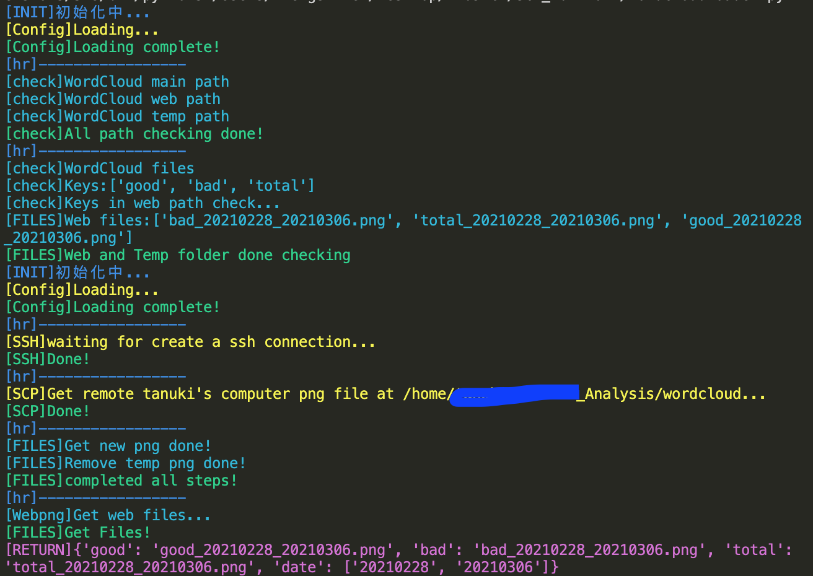
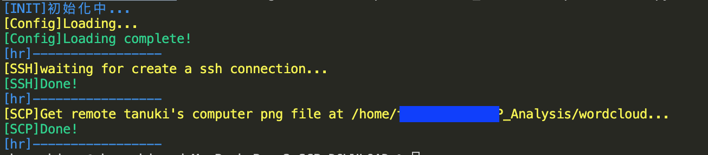

# SCP_DOWNLOAD

using scp to download files.

## Usage
modify config.yaml to your parameter.
```bash
sudo python3 FilesLoader.py
```
result:

The py program will check temp and correct folder is exist. Second, set a ssh connect session. Third, check all files and correct files and temp files. At last, check temp files and correct by date, if temp is newest, covert temp to showOnWeb.
```Python
getWebFiles()
```
This function can return what files in showOnWeb by classify.
Will like be
```json
{"key1": "key1_20210228_20210306.png", "key2": "key2_20210228_20210306.png", "key3": "key3_20210228_20210306.png", "date": ["20210228", "20210306"]}
```
you can modify what yo want.

---

### scpDownloader.py
To download the reomte computer files.
Just get the files.
SetSSH and create session and download files.
```bash
sudo python3 scpDownloader.py
```
retult.
